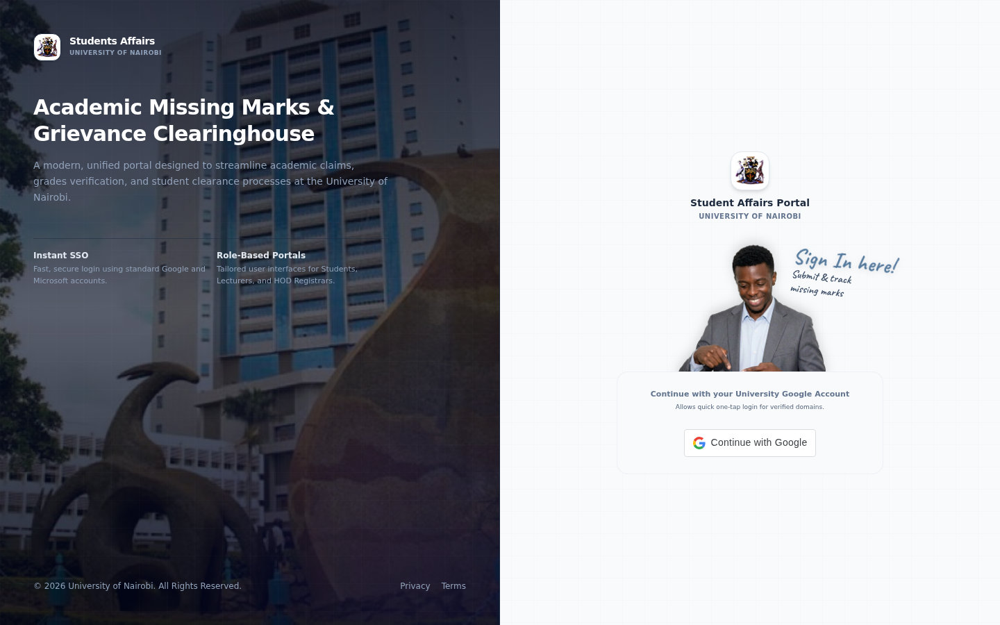
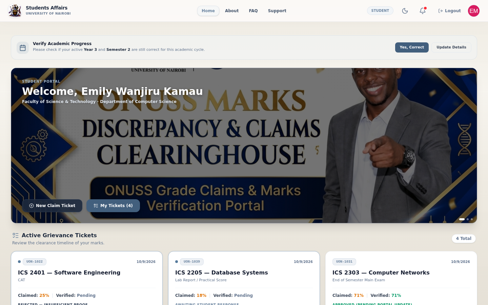
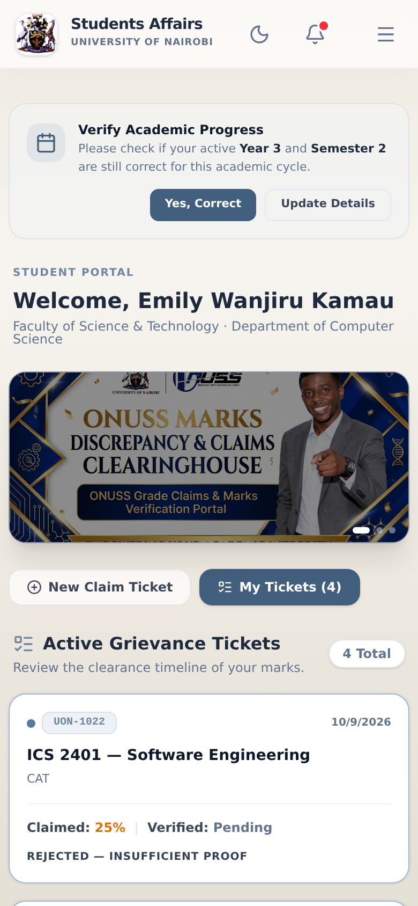
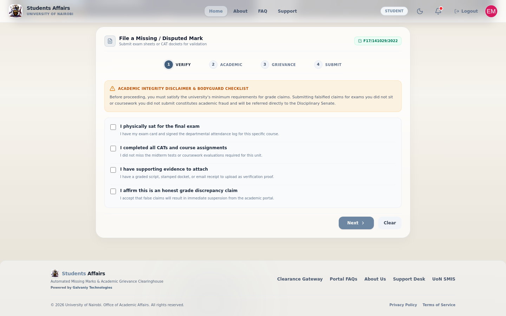
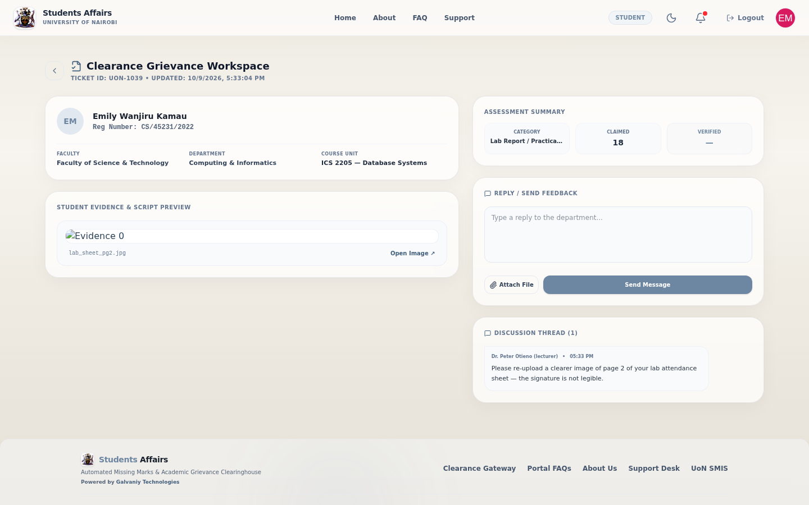
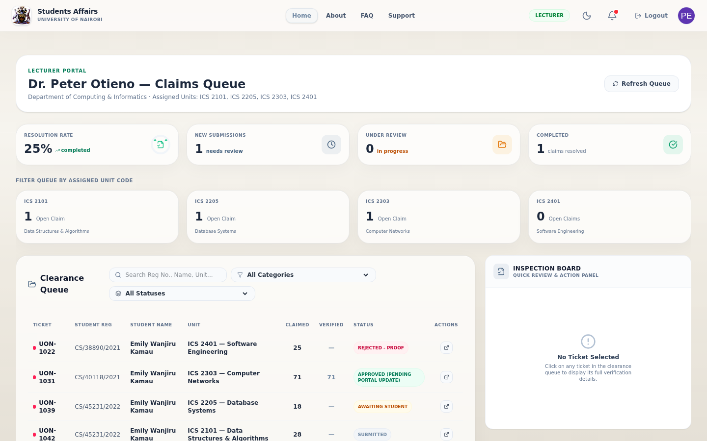
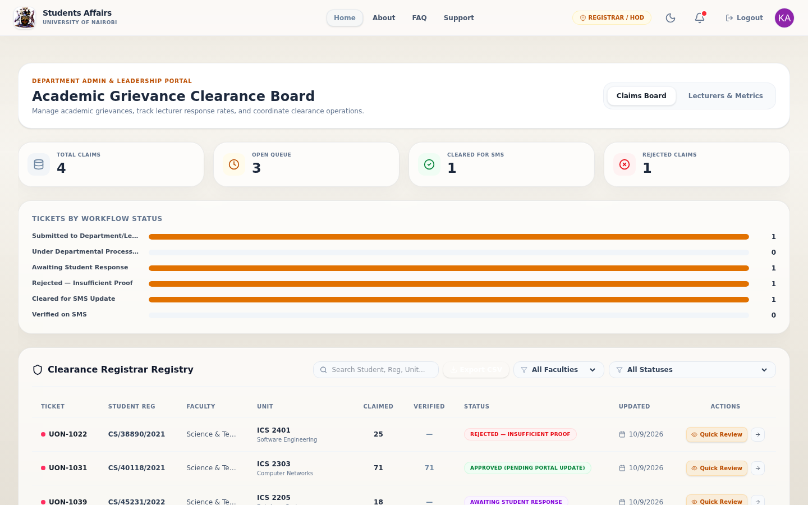

# Students Affairs portal: user guide

The portal is where missing or disputed marks get resolved. A student files a claim with evidence; the lecturer checks it and updates the mark; the department makes sure the corrected mark reaches the student records system (SMIS). Everyone can see where a claim stands at any time.

The screenshots use the portal's demo accounts and example claims.

## Contents

- [Signing in](#signing-in)
- [For students](#for-students)
- [For lecturers](#for-lecturers)
- [For department administrators](#for-department-administrators)
- [What each status means](#what-each-status-means)
- [Emails you'll get](#emails-youll-get)
- [Questions](#questions)

## Signing in

Click **Continue with Google** and choose your Google account. Use your university account if you have one:

- **Students:** your `@student.uonbi.ac.ke` account, or any Google account you use
- **Lecturers and staff:** your `@uonbi.ac.ke` account. That's how the portal knows you're staff.

The first time a student signs in, the portal asks for your academic profile: registration number, campus, faculty, department, course, year and semester. Claims are filed with these details, so keep them current. From time to time the portal asks you to confirm that your year and semester are still right (**Yes, Correct** or **Update Details**).

## For students

### Your portal

After signing in you see your portal: your claims with their current status, claimed and verified marks, and the latest update.

| On a computer | On a phone |
|---|---|
|  |  |

### Filing a claim

Click **New Claim Ticket**. The form has four steps:

1. **Verify.** Confirm the academic integrity checklist: you sat the exam, completed the coursework, have evidence, and the claim is honest. A false claim is referred to the disciplinary process.
2. **Academic.** Your faculty, department and the unit (course code and name).
3. **Grievance.** Fill in:
   - the assessment: a CAT, the main exam, a lab report or practical, and so on
   - the mark you believe you got
   - the lecturer's name and university email
   - which coursework items you completed
   - your evidence: up to 3 files, 3 MB each, as PDF, image (PNG, JPG, HEIC) or Word document. Good evidence includes a graded script, a stamped exam docket, a signed attendance sheet, or an email from the lecturer.
4. **Submit.** Check everything and send.

Your claim gets a ticket number such as **UON-1047**. Quote it if you contact the department.

### Following up

Open a claim to see its workspace: your details, the assessment summary, your evidence, and the discussion with the lecturer.

If the status is **Awaiting Student Response**, the lecturer needs something from you, usually clearer evidence. Read their message, reply under **Reply / Send Feedback**, and attach files with **Attach File**.

## For lecturers

Sign in with your `@uonbi.ac.ke` Google account. Your portal is the **claims queue**:

- **The cards at the top** show your resolution rate and how many claims are new, under review and completed.
- **Filter by unit** with the unit cards, or by category and status with the filters. Search finds a registration number, name or unit.
- **Click a claim** to open it in the **Inspection Board**. There you can check the evidence and discussion, enter the verified mark, change the status, and write to the student.

Typical outcomes:

| The evidence shows… | Set the status to |
|---|---|
| The mark is right and needs entering | **Cleared for SMS Update**, with the verified mark |
| You need clearer or more evidence | **Awaiting Student Response**, and say exactly what's missing |
| The claim isn't supported | **Rejected — Insufficient Proof**, with the reason |
| It needs the department or HOD | **Escalate** (see below) |

Each status change emails the student.

**Escalating.** If a claim needs the head of department or an administrator, escalate it with their name, email and a note. They get an email, the claim moves to **Under Departmental Processing**, and the escalation appears in the claim's discussion.

## For department administrators

Administrators get the **Academic Grievance Clearance Board**:

- **Claims Board:**
  - totals (all claims, open, cleared for SMS, rejected)
  - a chart of claims by status
  - the registry of every claim, which you can filter by faculty and status, search, and export with **Export CSV**
  - **Quick Review** opens a claim without leaving the board.
- **Lecturers & Metrics:** how quickly lecturers respond, so you can follow up on stalled claims.

When a cleared mark has been entered in SMIS, set the claim to **Verified on SMS**. That closes the loop for the student.

Administrator access is given by the portal's maintainers. It can't be requested through sign-in.

## What each status means

| Status | Meaning | Who acts next |
|---|---|---|
| Submitted to Department/Lecturer | New claim, waiting for the lecturer | Lecturer |
| Under Departmental Processing | Being handled, or escalated to the department or HOD | Department |
| Awaiting Student Response | The lecturer asked the student for something | Student |
| Rejected — Insufficient Proof | Not supported by the evidence given | — (the student can file again with better evidence) |
| Cleared for SMS Update | The mark is confirmed and needs entering in SMIS | Department |
| Verified on SMS | The corrected mark is in SMIS | Done |

## Emails you'll get

| You are | You get an email when |
|---|---|
| A student | The status of one of your claims changes |
| A lecturer | A student files a claim naming you. Several new claims are combined into one email |
| An HOD or administrator | A claim is escalated to you |

## Questions

| Question | Answer |
|---|---|
| I can't find my claim | Make sure you're signed in with the same Google account you used to file it |
| My file won't upload | Each file must be under 3 MB, and at most 3 files go up at once. Allowed: PDF, PNG, JPG, HEIC, DOC, DOCX |
| I'm a lecturer but I see the student portal | Sign in with your `@uonbi.ac.ke` account, not a personal one |
| Who can see my evidence? | You, and the lecturers and administrators handling claims. Anyone who has a file's exact link can also open it, so don't share those links |
| Something else | Use **Support** in the top menu |
